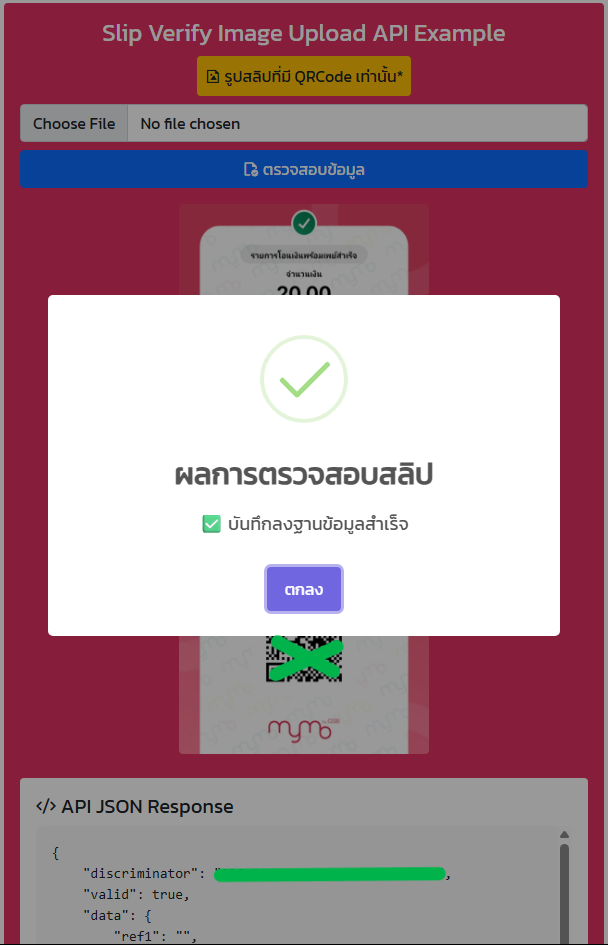
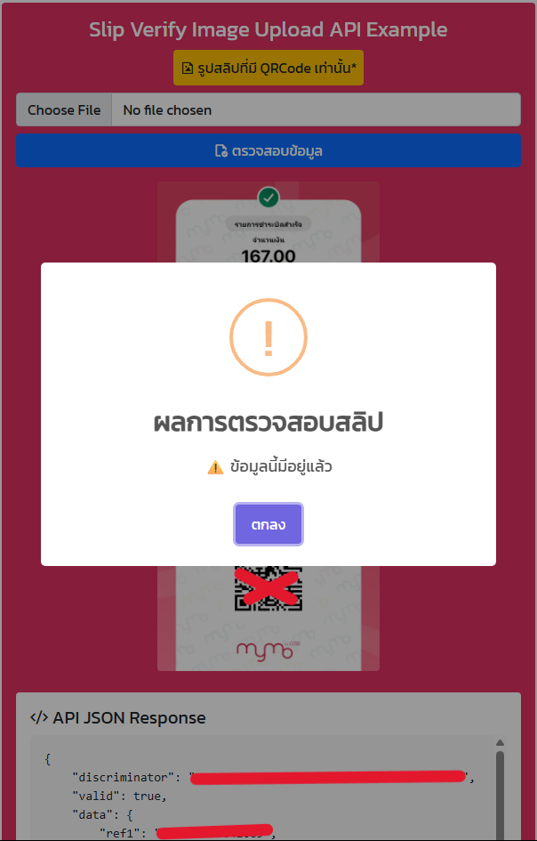
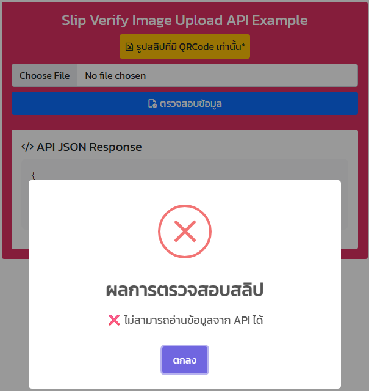

# Example-SlipVerify

โค้ดตัวอย่างการใช้งาน https://slip.rdcw.co.th/ เป็นการทดสอบตรวจสอบเงื่อนไขการตอบกลับจาก API จับข้อความ JSON แล้วเช็คเงื่อนไข
แสดงผลการตอบกลับ JSON และแสดงตัวอย่างรูปการไฟล์ที่อัปโหลด

